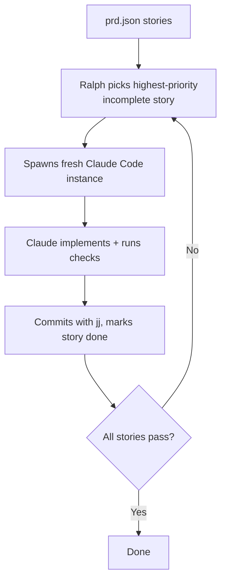

# Ralph++

[](https://github.com/ohjann/ralphplusplus/actions/workflows/ci.yml)

[GitHub](https://github.com/ohjann/ralphplusplus) | [Radicle](https://app.radicle.xyz/nodes/iris.radicle.xyz/rad:z3hUHk2YiryoaHTS7jkbpAwGw3qd8)

Ralph runs [Claude Code](https://docs.anthropic.com/en/docs/claude-code) in a loop until all user stories in a PRD are done. Each iteration gets a fresh context window. Memory carries over through version control history, `progress.md`, `prd.json`, and markdown files in `.ralph/memory/`.

Based on [Geoffrey Huntley's Ralph pattern](https://ghuntley.com/ralph/).

## Why Ralph?

Claude Code is good at one well-scoped task. But a real feature is 5-15 tasks with ordering constraints, and context resets between sessions. Ralph fills that gap. You write the stories, it handles sequencing, memory, verification, and retry. You can walk away and come back to a finished feature, or watch the TUI while it works.

## How It Works



Memory between iterations comes from jj history, `progress.md`, `prd.json` status, per-story state files, and markdown memory in `.ralph/memory/`.

## Prerequisites

- **Go 1.25+** (for building from source)
- **[Claude Code](https://docs.anthropic.com/en/docs/claude-code)** installed and authenticated (`npm install -g @anthropic-ai/claude-code`)
- **[jj (Jujutsu)](https://martinvonz.github.io/jj/)** for version control. Ralph uses jj, not git. The workspace isolation and mutable commit model make parallel workers much simpler, but it means you need jj installed and initialized in your project (`jj git init --colocate` in an existing git repo)

No vector databases or ML infrastructure needed. Memory is plain markdown files.

## Quick Start

```bash
# Build
make build

# Option 1: Plan-driven (recommended)
# Create a plan using Claude Code's /plan command, then:
ralph --plan .claude/plans/my-plan.md

# Option 2: Existing prd.json
ralph

# Option 3: Interactive mode (no prd.json needed)
# Just run ralph without a prd.json — it auto-detects and presents an input bar
ralph
```

## What it does

- DAG analysis finds story dependencies, independent stories run across N workers in isolated jj workspaces (`--workers 3` or `--workers auto`)
- A separate Claude instance (Sonnet) reviews each story after implementation and can reject it (`--no-judge` to disable)
- Complex stories spawn competing implementations in parallel; the judge picks the best one
- After all stories pass, lens reviewers (security, efficiency, DRY, error handling, testing) examine the full changeset
- If Claude gets stuck in a loop, Ralph detects it, notifies you, and lets you inject a hint
- Code simplification pass runs between implementation and judge verification
- Cross-run learnings persist in `.ralph/memory/` as markdown, with periodic consolidation
- Ad-hoc tasks via TUI input bar, no prd.json needed
- Opus for architect/debugger, Sonnet for implementer/reviewer, Haiku for utility tasks (all configurable)
- Orchestration state checkpointed after every story event; resume on restart

## Documentation

| Document | Contents |
|----------|----------|
| [Workflow & Modes](docs/workflow.md) | Planning, execution, parallel workers, judge, fusion, simplification, quality review, interactive mode |
| [Configuration](docs/configuration.md) | CLI reference, TUI keybindings, monitoring setup (ntfy.sh, status page, Tailscale) |
| [PRD Format](docs/prd-format.md) | `prd.json` schema, field reference, story sizing and ordering guidance |
| [Architecture](docs/architecture.md) | Project structure, memory system, workspace lifecycle, key files |

## Contributing

Ralph is a personal project. It works for my workflow but comes with no guarantees. It uses [Jujutsu (jj)](https://martinvonz.github.io/jj/) for version control, not git, which limits portability.

If you find it useful, fork it and make it your own. Bug reports and PRs are welcome but may not get merged if they don't fit the project's direction. No hard feelings either way.

## Acknowledgements

Started as a fork of [snarktank/ralph](https://github.com/snarktank/ralph), thanks to Ryan Carson for the initial foundations. The core idea comes from [Geoffrey Huntley's Ralph pattern](https://ghuntley.com/ralph/).

## References

- [Geoffrey Huntley's Ralph article](https://ghuntley.com/ralph/)
- [Claude Code documentation](https://docs.anthropic.com/en/docs/claude-code)
- [Jujutsu (jj) documentation](https://martinvonz.github.io/jj/)
